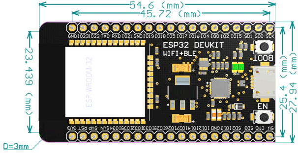

# Carte électronique d'accueil du module ESP32-WROOM-32D

Le module ESP32-DEVKITC-32D possède 38 broches et les dimensions sont :

Voir les détails de la [Datasheet](https://dl.espressif.com/dl/schematics/esp32_devkitc_v4-sch.pdf) du module.

PMF370XN, Not recommended for new designs (NRND), Alternatives PMF250XNE
N-channel TrenchMOS extremely low level FET
https://www.nexperia.com/products/mosfets/small-signal-mosfets/PMF370XN.html
https://assets.nexperia.com/documents/data-sheet/PMF370XN.pdf
https://fr.farnell.com/nexperia/pmf370xn-115/transistor-mosfet-n-30v-870ma/dp/1758096
Type de boîtier de transistor: SOT-323
Modèle composant équivalent sous KiCad : BS170F, BS870, 2N7002E, H, K, AO3400A***

Transistor de puissance Mosfet 20V 3.7A, 100 pièces, IRLML6402 sot-23 p-channel
https://fr.aliexpress.com/item/32716087801.html
https://www.infineon.com/cms/en/product/power/mosfet/p-channel/irlml6402/
https://www.infineon.com/dgdl/Infineon-IRLML6402-DataSheet-v01_01-EN.pdf?fileId=5546d462533600a401535668d5c2263c

TODO CAD Models: Symbol, Footprint, 3D Model

[Faire une demande de quotation du PCB chez NextPCB](https://www.nextpcb.com/pcb-quote?layer=4&length=&width=&count=10&height=1.6).

PCB Calculator

* PCB file: Gerber-Files
* Material: Fr-4
* Layer Count: 4 Layers
* TG: TG130
* Board Type: Single piece
* Size(single): l x L mm
* Quantity (single): 10
* PCB Thickness: 1.6
* Solder Mask Color: Green
* Silkscreen: White
* Finished Copper Weight: 1oz
* Inner Copper Weight: 0.5oz
* Min. Trace / Space Outer: 6/6mil
* Min. Drilled Hole: 0.3mm
* Via Process: Tenting Vias
* Surface Finish: HASL
* Beveling of G/F: NO
* Electrical Test: Sample Test Free
* Approve Working Gerber: Don't need
* Plated Half-holes/Castellated Holes: NO
* Impedance: NO
* Microsection Analysis Report: NO
