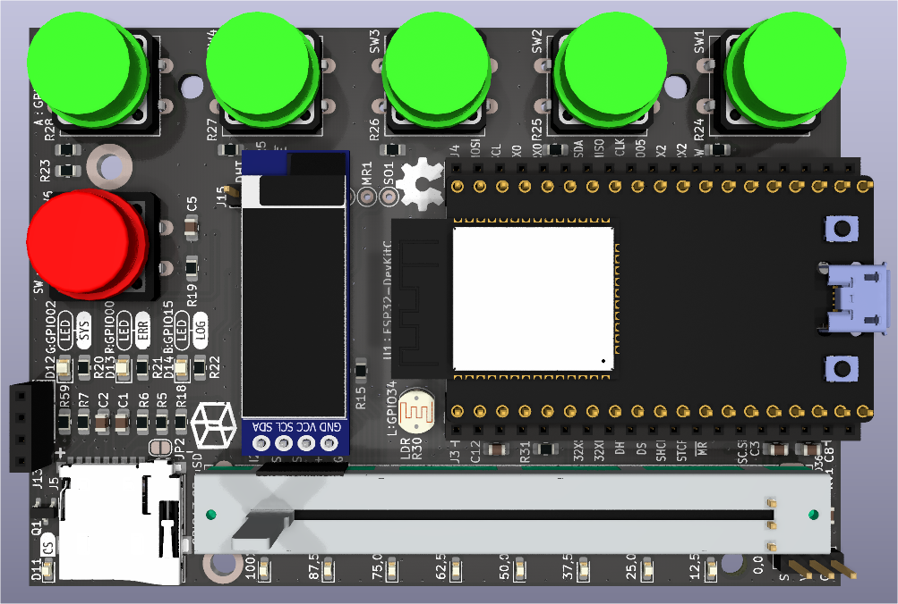
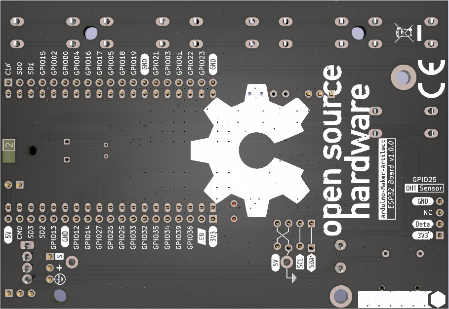
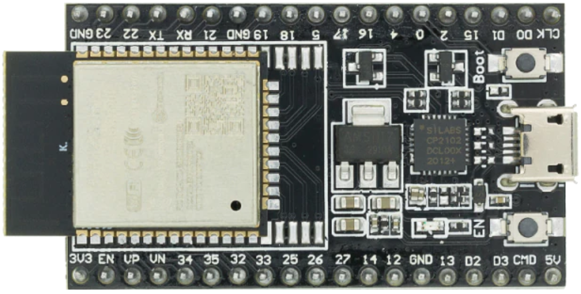

# Documentation technique du projet

<html>

<table align='left' border='0' cellpadding='0'>
<tr class="noBorder">
<td></td>
<td>Schématique de la carte "<I>A-M-A-ESP32-Board</I>"
</td>
</tr>
</table>

 
</html>

## La carte A-M-A-ESP32-Board

|                    Placement des composants                    |                  Sérigraphie coté cuivre screen                   |
| :------------------------------------------------------------: | :---------------------------------------------------------------: |
|  |  |
|                         Vue de dessus                          |                          Vue de dessous                           |

Voir la liste des composants et le coût de la carte : [Bill Of Materials (BOM)](BOM.md)

Datasheet [ESP32-DevKitC-1](https://docs.espressif.com/projects/arduino-esp32/en/latest/boards/ESP32-DevKitC-1.html)

<!--

-->

---

## Brochage de la carte ESP32-WROOM-32D, 38 broches

<!--

-->
<html>

<table align='center' border='0' cellpadding='0'>
<tr class="noBorder">
<td></td>
<tr class="noBorder">
<td><a href="https://www.studiopieters.nl/esp32-pinout/" title="" target="_blank">Source : https://www.studiopieters.nl/esp32-pinout/</a></td>
</tr>
</table>

</html>

---

<html>

<table align='center' border='0' cellpadding='0'>
<tr class="noBorder">
<td></td>
<tr class="noBorder">
<td><a href="" title="" target="_blank">Source : </a></td>
</tr>
</table>

</html>
