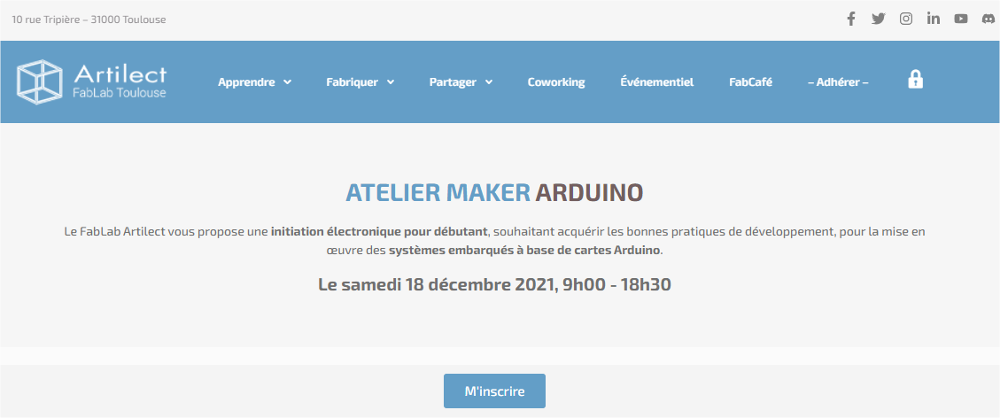

# Arduino-Maker-Artilect-ESP32-Board

Conception d'une carte électronique permettant d'accueillir la carte ESP32-WROOM-32D pour l'Arduino-Maker-Artilect ;-)

<!--

-->

voir "[Formation Arduino Maker Artilect 2021](https://docs.google.com/document/d/1AiOmVbQlEdjEwbFdklUuR_bQvMPeL1gh1BUjC_LPH7M/edit?usp=sharing)"

“[Fab-Tronic](https://artilect.fr/fabtronic/)”, la section thématique autour de l’électronique.

<html>

<table align='left' border='0' cellpadding='0'>
<tr class="noBorder">
<td></td>
<td>Pour plus d'informations, venez nous rendre visite sur notre chaîne Discord à l'adresse : <a href="https://discord.gg/aPnZ5Q7w6Q">https://discord.gg/aPnZ5Q7w6Q</a></td>
</tr>
</table>

</html>

---

## Les outils logiciels utilisés

### Conception de la carte électronique

[KiCad EDA - Logiciel de capture schématique et de conception de circuits imprimés](https://kicad.org/), [version 6.0.0 => kicad-msvc.r25345.99ec2b1801-x86_64.exe](https://downloads.kicad.org/kicad/windows/explore/nightlies)

[Logiciel open source](https://fr.wikipedia.org/wiki/Open_source) [EDA](https://fr.wikipedia.org/wiki/Conception_assist%C3%A9e_par_ordinateur_pour_l%27%C3%A9lectronique) / [CAO électronique](https://en.wikipedia.org/wiki/Comparison_of_EDA_software) pour Windows, macOS et Linux.

---

## Open Source Hardware Association

<!--  -->

<html>

<table align='left' border='0' cellpadding='0'>
<tr class="noBorder">
<td></td>
<tr class="noBorder">
<td><a href="https://www.oshwa.org/" title="" target="_blank">Source : https://www.oshwa.org/</a></td>
</tr>
</table>

</html>
