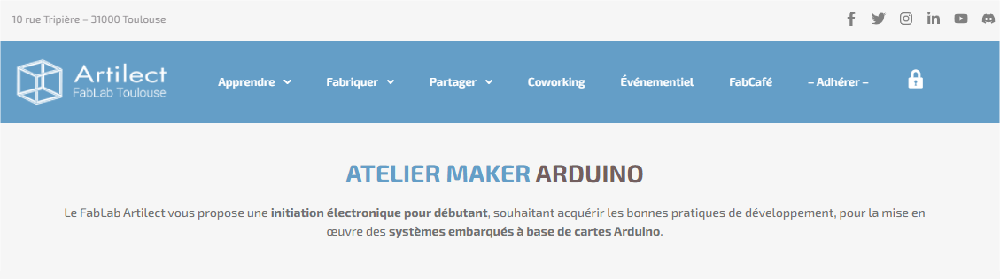

# Arduino-Maker-Artilect-ESP32-Board

Conception d'une carte électronique permettant d'accueillir le module **ESP32-WROOM-32D** pour les ateliers Arduino ESP32 :

<!--

-->
<html>
<table align='left' border='0' cellpadding='0'>
<tr class="noBorder">
<td>

</td>
</tr>
<tr class="noBorder">
<td>
<b>*** Objectifs ***</b> 
Initiation à l'électronique pour débutant, souhaitant acquérir les bonnes pratiques de développement, pour la mise en œuvre des systèmes embarqués à base de cartes Arduino type ESP32 :  
<ul>
  <li>Découvrir la programmation des cartes Arduino en langage C/C++ à travers des cas pratiques.</li>
  <li>Précautions de mise en œuvre, sécurité d’utilisation, alimentation de la carte et des périphériques.</li>
  <li>Prise en main des cartes microcontrôleurs ESP32.</li>
  <li>Mise en œuvre de nombreux périphériques d’entrée/sortie.</li>
  <li>Mise en oeuvre ESP32 avec PlatformIO.</li>
  <li>Vers les bases d’Arduino et au-delà...</li>
</ul>
</td>
</tr>
<tr class="noBorder">
<td>

</td>
</tr>
</table>

 
</html>

[FabTronic](https://artilect.fr/fabtronic/), la section thématique des makers autour de l’électronique.

<html>

<table align='left' border='0' cellpadding='0'>
<tr class="noBorder">
<td></td>
<td>Pour plus d'informations, venez nous rendre visite sur notre chaîne Discord à l'adresse : <a href="https://discord.gg/aPnZ5Q7w6Q">https://discord.gg/aPnZ5Q7w6Q</a> 
Une fois connecté au serveur FabTronic, nous vous invitons à vous présenter dans le salon <b><i>#présentation</i></b>
</td>
</tr>
</table>

 
</html>

---

## [Documentation](Docs/README.md)

### Logiciel utilisé pour la conception de la carte électronique

[KiCad EDA - Logiciel open source de capture schématique et de conception de circuits imprimés](https://kicad.org/)

Téléchargement [Windows All Stable Releases > kicad-6.0.10-x86_64.exe](https://downloads.kicad.org/kicad/windows/explore/stable)

[Logiciel open source](https://fr.wikipedia.org/wiki/Open_source) [EDA](https://fr.wikipedia.org/wiki/Conception_assist%C3%A9e_par_ordinateur_pour_l%27%C3%A9lectronique) / [CAO électronique](https://en.wikipedia.org/wiki/Comparison_of_EDA_software) pour Windows, macOS et Linux.

[Retrouvez la schématique de la carte, ainsi que la liste de matériels nécessaire pour l'assemblage (BOM).](Docs/README.md)

---

## Open Source Hardware Association

<!--  -->

<html>

<table align='left' border='0' cellpadding='0'>
<tr class="noBorder">
<td align='center' border='0'></td>
<tr class="noBorder">
<td align='center' border='0'><a href="https://www.oshwa.org/" title="" target="_blank">Source : https://www.oshwa.org/</a></td>
</tr>
</table>

</html>
